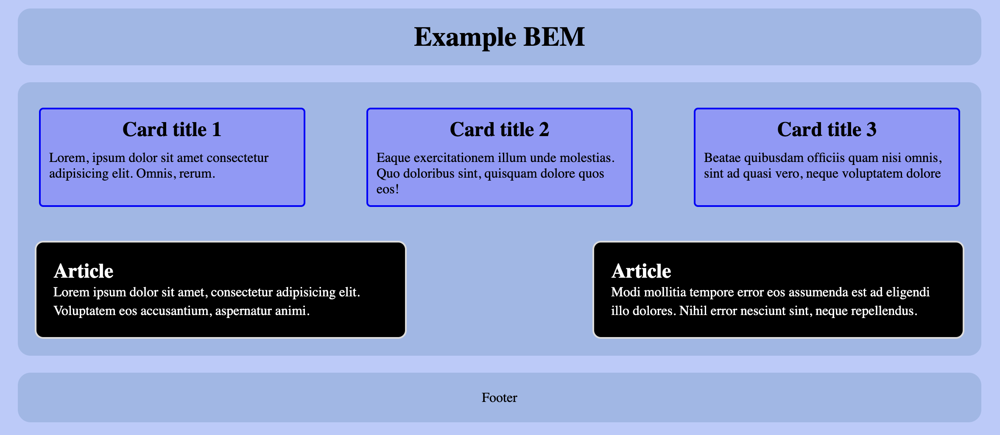
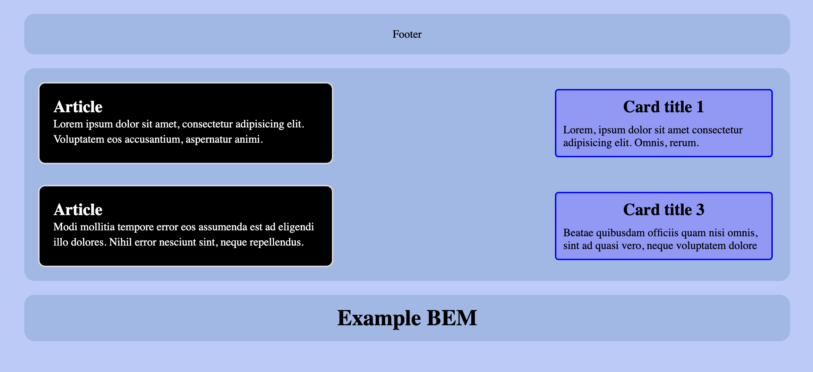
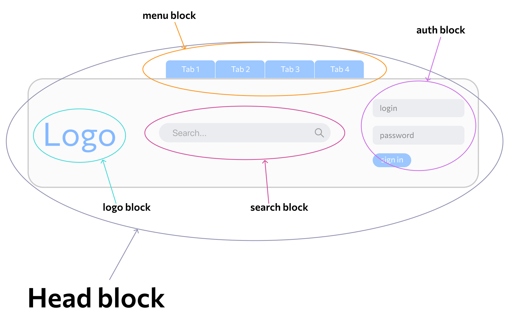
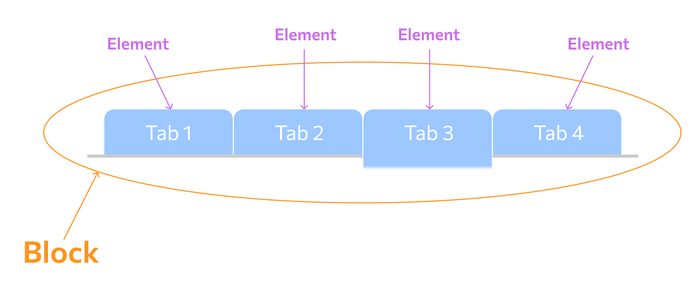
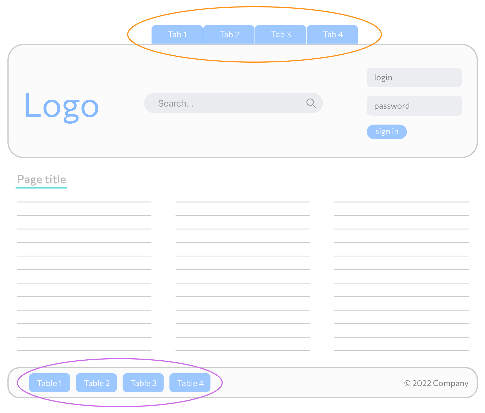
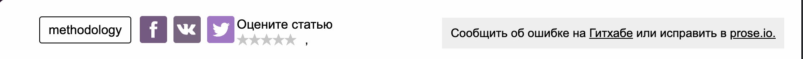
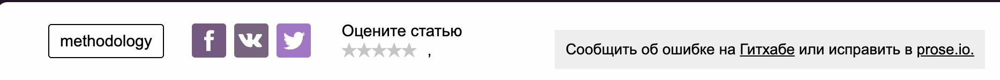

# Что переделать
  1. -

# БЭМ

## Содержание
- [Что такое БЭМ](#what-bem)
- [Блок](#block)
  - [Независимость](#independent)
  - [Примеры блоков](#block-examples)
  - [Правила использования блоков](#block-rules)
  - [Название файла](#block-file-name)
  - [Пример](#block-example)
- [Элемент](#element)
  - [Примеры элементов](#element-examples)
  - [Правила использования элементов](#element-rules)
  - [Пример](#element-example)
- [Модификатор](#modifier)
  - [Виды модификаторов](#modifier-kinds)
  - [Правила использования модификаторов](#modifier-rules)
  - [Примеры модификаторов](#modifier-examples)
  - [Пример](#modifier-example)
- [Микс](#mix)
  - [Что можно комбинировать](#mix-combine)
  - [Пример](#mix-example)
- [Стили](#styles)
- [CSS](#css)
  - [Вложенность и специфичность CSS](#css-specificity)
  - [Принцип открытости/закрытости](#css-open-close-principle)
- [Структура файлов](#file-structure)

## <a name="what-bem"></a>Что такое БЭМ

**БЭМ (блок, элемент, модификатор)** - методология, которая дает разработчикам разумный способ дать имена вашим CSS-классам,
чтобы сделать их более прозрачными и понятными для других.

В основе БЭМ — соглашение по именованию, которое делает имена CSS-классов максимально информативными для разработчиков и позволяет многократно использовать компоненты.

## <a name="block"></a>Блок

**Блок** - это [**независимая**](#independent) сущность, которая представляет собой часть интерфейса на странице.
Каждый из блоков может иметь свою разметку, стили и скрипты. Название блока характеризует смысл ("Что это?" - "меню": menu, "кнопка": button)

> Наименование класса блока:<br>"имя-блока"

В интерфейсе может существовать несколько экземпляров одного и того же определения блока (например, различные кнопки или несколько меню).
Также практически всегда блоки имеют корневой блок, который служит оберткой для других элементов блока (например почти все блоки находятся внутри блока container).

<details open>
  <summary>
    Пример HTML
  </summary>

  ```html
  <div class="container">
    <header class="header">
      
      <button class="btn"/>
    </header>

    <main class="main">
      <section clas="about">
        <button class="btn"/>
      </section>
      <section class="search">
      </section>
    </main>

    <footer class="footer">
      <small class="copyright">
      </small>
    </footer>
  </div>
  ```
</details>

В примере выше, в качестве блоков выступает все теги, у которых есть класс:
1. container
2. header
3. logo
4. main
5. about
6. btn
7. search
8. footer
9. copyright

### <a name="independent"></a>Независимость
**Независисая сущность** - Сущность, которая не зависит от внешней среды.

Ниже представлен пример



<details>
  <summary>
    Пример HTML
  </summary>

  ```html
  <div class="container">
    <header class="header">
      <h1 class="header__title">
        Example BEM
      </h1>
    </header>

    <main class="main">
      <section class="store">
        <div class="card">
          <div class="card__header">
            <h2 class="card__title">
              Card title 1
            </h2>
          </div>

          <div class="card__body">
            <p class="card__description">
              Lorem, ipsum dolor sit amet consectetur adipisicing elit. Omnis, rerum.
            </p>
          </div>
        </div>

        <div class="card">
          <div class="card__header">
            <h2 class="card__title">
              Card title 2
            </h2>
          </div>

          <div class="card__body">
            <p class="card__description">
              Eaque exercitationem illum unde molestias. Quo doloribus sint, quisquam dolore quos eos!
            </p>
          </div>
        </div>

        <div class="card">
          <div class="card__header">
            <h2 class="card__title">
              Card title 3
            </h2>
          </div>

          <div class="card__body">
            <p class="card__description">
              Beatae quibusdam officiis quam nisi omnis, sint ad quasi vero, neque voluptatem dolore
            </p>
          </div>
        </div>
      </section>

      <section class="articles">
        <div class="article">
          <h2 class="article__title">
            Article
          </h2>
          <p class="article__desc">
            Lorem ipsum dolor sit amet, consectetur adipisicing elit. Voluptatem eos accusantium, aspernatur animi.
          </p>
        </div>

        <div class="article">
          <h2 class="article__title">
            Article
          </h2>
          <p class="article__desc">
            Modi mollitia tempore error eos assumenda est ad eligendi illo dolores. Nihil error nesciunt sint, neque repellendus.
          </p>
        </div>
      </section>
    </main>

    <footer class="footer">
      <p class="footer__text">Footer</p>
    </footer>
  </div>
  ```
</details>

Так как блоки являются **независимыми**, мы можем менять их на странице местами, зная что мы ничего не сломаем



<details>
  <summary>
    Пример HTML
  </summary>

  ```html
  <div class="container">
    <footer class="footer">
      <p class="footer__text">Footer</p>
    </footer>

    <main class="main">
      <section class="articles">
        <div class="article">
          <h2 class="article__title">
            Article
          </h2>
          <p class="article__desc">
            Lorem ipsum dolor sit amet, consectetur adipisicing elit. Voluptatem eos accusantium, aspernatur animi.
          </p>
        </div>

        <div class="card">
          <div class="card__header">
            <h2 class="card__title">
              Card title 1
            </h2>
          </div>

          <div class="card__body">
            <p class="card__description">
              Lorem, ipsum dolor sit amet consectetur adipisicing elit. Omnis, rerum.
            </p>
          </div>
        </div>
      </section>

      <section class="store">
        <div class="article">
          <h2 class="article__title">
            Article
          </h2>
          <p class="article__desc">
            Modi mollitia tempore error eos assumenda est ad eligendi illo dolores. Nihil error nesciunt sint, neque repellendus.
          </p>
        </div>

        <div class="card">
          <div class="card__header">
            <h2 class="card__title">
              Card title 3
            </h2>
          </div>

          <div class="card__body">
            <p class="card__description">
              Beatae quibusdam officiis quam nisi omnis, sint ad quasi vero, neque voluptatem dolore
            </p>
          </div>
        </div>
      </section>
    </main>

    <header class="header">
      <h1 class="header__title">
        Example BEM
      </h1>
    </header>
  </div>
  ```
</details>

Но для такого поведения на блоки введены [правила](#block-rules)

### <a name="block-examples"></a>Примеры блоков:
- Навигационное меню;
- Таблица;
- Форма;
- Кнопка;
- Список;
- Шапка страницы.

### <a name="block-rules"></a>Правила использования блоков
1. Блокам нельзя писать внешние размеры и позиционирование (margin, position)
2. Внутри одних блоков могут быть сколько угодно блоков

### <a name="block-file-name"></a>Название файла
Каждый блок должен находиться в отдельном файле.
Имя файла должно равняться названию блока.

<details open>
  <summary>
    Пример SCSS
  </summary>

  ```scss
  // Filename: _btn.scss
  .btn {
    $font-size: 0.5em;

    display: inline-block;
    width: $font-size;
    height: $font-size;
    background-color: antiquewhite;
    border-radius: 100%;

    &--highlighted {
      background-color: yellow;
    }
  }
  ```
</details>

### <a name="block-example"></a>Пример
Разберем шапку сайта.



<br>

<details open>
  <summary>
    Пример HTML
  </summary>

  ```html
  <header class="header">
    <div class="header__inner">

      <div class="header__top">
        <nav class="menu">
          <ul class="menu__list">
            <li class="menu__item">
              <a class="menu__link" href="#">
                Tab 1
              </a>
            </li>
            <li class="menu__item">
              <a class="menu__link" href="#">
                Tab 2
              </a>
            </li>
            <li class="menu__item">
              <a class="menu__link" href="#">
                Tab 3
              </a>
            </li>
            <li class="menu__item">
              <a class="menu__link" href="#">
                Tab 4
              </a>
            </li>
          </ul>
        </nav>
      </div>

      <div class="header__bottom">
        <div class="logo">
          
        </div>
        <div class="search">
          <form class="search__form">
            <input class="search__input" type="search">
          </form>
        </div>
        <div class="auth">
          <form class="auth__form">
            <input class="auth__input" type="text">
            <input class="auth__input" type="password">
            <button class="auth__btn">
              sign in
            </button>
          </form>
        </div>
      </div>

    </div>
  </header>
  ```
</details>

Здесь имеются 5 блоков:
- menu block;
- search block;
- auth block;
- logo block;
- head block.

Внутри head block мы можем двигать блоки как захотим. К примеру мы можем поменять блоки logo block и search block местами зная что внешний вид от этого не изменится в худшую сторону (из-за **независимости** блоков).

Каждый блок может состоять из **элементов**, которые являются составной частью блока и имеют с ним тесную связь.

---

## <a name="element"></a>Элемент
**Элемент** - часть блока, зависимая от него семантически и функционально. Название элемента, как и название блока, характеризует смысл («Что это?» — "пункт": item, "текст": text)

> Наименование класса элемента: отделяется двойным подчеркиванием.<br>"имя-блока__имя-элемента".

Элементы не могут существовать за пределами блока, к которому принадлежат. **У всех элементов должен быть родительский блок**.
<details open>
  <summary>
    Пример HTML
  </summary>

  ```html
  <!-- Хорошо -->
  <div class="about">
    <div class="about__inner">
      <div class="about__items"></div>
    </div>
  </div>

  <!-- Плохо: элемент НЕ находится внутри блока about -->
  <div class="about__header"></div>
  ```
</details>

### <a name="element-examples"></a>Примеры элементов:
- Навигационное меню (блок), содержащее пункты меню (элементы);
- Таблица (блок), содержащая ячейки и заголовки (элементы);
- Форма (блок), содержащая поля ввода (элементы).

### <a name="element-rules"></a>Правила использования элементов
1. Элемент без блока существовать не может;
2. Внутри элементов могут быть сколько угодно элементов;
3. Элемент — всегда часть блока, а не другого элемента. Это означает, что в названии элементов нельзя прописывать иерархию вида block__elem1__elem2.

<details open>
  <summary>
    Пример HTML
  </summary>

  ```html
  <div class="about">
    <div class="about__inner">
      <!-- Хорошо -->
      <div class="about__items"></div>

      <!-- Плохо: элемент элемента не бывает-->
      <div class="about__inner__items"></div>
    </div>
  </div>

  <!-- Плохо: Элемент about__footer находится за пределами своего блока about -->
  <div class="about__footer"></div>
  ```
</details>

### <a name="element-example"></a>Пример
Разберем блок menu block из [примера блока](#header-example).



<br>
<details open>
  <summary>
    Пример HTML
  </summary>

  ```html
  <nav class="menu">
    <ul class="menu__list">
      <li class="menu__item">
        <a class="menu__link" href="#">
          Tab 1
        </a>
      </li>
      <li class="menu__item">
        <a class="menu__link" href="#">
          Tab 2
        </a>
      </li>
      <li class="menu__item">
        <a class="menu__link" href="#">
          Tab 3
        </a>
      </li>
      <li class="menu__item">
        <a class="menu__link" href="#">
          Tab 4
        </a>
      </li>
    </ul>
  </nav>
  ```
</details>

Здесь имеются 4 элемента

Вкладки (Tab 1, Tab 2, Tab 3, Tab 4) принадлежат menu block и не могут использоваться вне блока!

---

## <a name="modifier"></a> Модификатор
**Модификатор** - сущность, которая определяет внешний вид, состояние и поведение. Модификатор может задаваться как блоку, так и элементу. Название характеризует блок/объект "Какой размер?", "Какая тема?", "Какой статус?"

> Класс модификатора: отделяют от имени блока или элемента двойным дефисом (--)<br>"имя-блока--значение-модификатора" ИЛИ<br>"имя-блока__имя-элемента--значение-модификатора" ИЛИ<br>"имя-блока__имя-элемента--имя-модификатора--значение-модификатора" [хзхз].

Для одного элемента/блока допускается использование нескольких модификаторов, если они представляют разные свойства. **Модификатор нельзя использовать самостоятельно**.

<details open>
  <summary>
    Пример HTML
  </summary>

  ```html
  <!-- Хорошо -->
  <button class="button button--primary button--inactive">
  </button>
  <div class="card card--theme-transparent">
    <div class="card__header"></div>
    <div class="card__content"></div>
  </div>

  <!-- Плохо: модификатор используется без блока -->
  <div class="form--primary">
    <div class="form__group">
      <input class="form__input">
    </div>
  </div>
  ```
</details>

### <a name="modifier-kinds"></a>Виды модификаторов
1. Логические - Применяют, когда факт наличия модификатора важнее, чем его значение (visible: true или false, active, disabled и т.д.);
2. Ключ-значение - Используют в тех случаях, когда значение модификатора важно (size: large, medium, small, theme: winter, dark, light).

<details open>
  <summary>
    Пример HTML
  </summary>

  ```html
  <!-- Пример: модификатор логический -->
  <button class="btn btn--inactive"></button>
  <button class="btn btn--lg"></button>

  <!-- Пример: модификатор ключ-значение -->
  <div class="card card--theme-dark"></div>
  <a class="icon icon--pdf"></a>
  ```
</details>

### <a name="modifier-rules"></a>Правила использования модификаторов
- Блоку или элементу нельзя одновременно присвоить разные значения модификатора;
- Модификатор одной БЭМ-сущности нельзя использовать вместе с другой;
- Модификатор нельзя использовать самостоятельно.

<details open>
  <summary>
    Пример HTML
  </summary>

  ```html
  <!-- Хорошо -->
  <div class="card card--theme-transparent">
    <div class="card__header"></div>
    <div class="card__content"></div>
  </div>

  <!-- Плохо: используются два значения модификатора theme -->
  <div class="card card--theme-transparent card--theme-dark">
    <div class="card__header"></div>
    <div class="card__content"></div>
  </div>

  <!-- Хорошо -->
  <div class="article form form--theme-black">
  </div>

  <!-- Плохо: модификатор блока form используется вместе с другим блоком article -->
  <div class="article form--theme-black">
  </div>


  <!-- Хорошо -->
  <button class="button button--primary button--active">...</button>

  <!-- Плохо: модификаторы используются без блока -->
  <button class="button--primary button--active">...</button>
  ```

</details>

### <a name="modifier-examples"></a>Примеры модификаторов
- Навигационное меню (блок), содержащее пункты меню (элементы), один из пунктов меню активен (модификатор);
- Кнопки (блок), которых может быть несколько видов (модификаторы);
- Текст состояния (блок), у которого может быть несколько цветов (модификаторы).

### <a name="modifier-example"></a>Пример
Разберем блок menu block из [примера блока](#header-example). Он находится в шапке (сверху) и в подвале (снизу) страницы.



<br>
<details open>
  <summary>Пример HTML</summary>

  ```html
  <!-- Верхнее menu-block -->
  <nav class="menu">
    <ul class="menu__list">
      <li class="menu__item">
        <a class="menu__link" href="#">
          Tab 1
        </a>
      </li>
      <li class="menu__item">
        <a class="menu__link" href="#">
          Tab 2
        </a>
      </li>
      <li class="menu__item">
        <a class="menu__link" href="#">
          Tab 3
        </a>
      </li>
      <li class="menu__item">
        <a class="menu__link" href="#">
          Tab 4
        </a>
      </li>
    </ul>
  </nav>

  <!-- Нижнее menu-block -->
  <nav class="menu menu--theme-round">
    <ul class="menu__list">
      <li class="menu__item">
        <a class="menu__link" href="#">
          Tab 1
        </a>
      </li>
      <li class="menu__item">
        <a class="menu__link" href="#">
          Tab 2
        </a>
      </li>
      <li class="menu__item">
        <a class="menu__link" href="#">
          Tab 3
        </a>
      </li>
      <li class="menu__item">
        <a class="menu__link" href="#">
          Tab 4
        </a>
      </li>
    </ul>
  </nav>
  ```
</details>

Внешний вид верхнего и нижнего меню заметно отличается.
По HTML нижнее и верхнее меню отличаются только тем, что у нижнего в блоке добавился класс "menu--theme-round"

## <a name="#mix"></a>Микс
**Микс** - способ комбинирования разных БЭМ-сущностей для одного DOM-узла.

> **БЭМ-сущности** - блоки, элементы и модификаторы.

Позволяют:
1. Совмещать поведение и стили нескольких сущностей без дублирования кода;
2. Одинаково форматировать разные HTML-элементы.

<details open>
  <summary>
    Пример HTML
  </summary>

  ```html
  <nav class="nav">
    <!-- Совмещение блока logo и элемента nav__logo = микс -->
    
    <h1>My webpage</h1>

    <ul class="menu">
      <li class="menu__link">Link 1</li>
      <li class="menu__link">Link 2</li>
      <li class="menu__link">Link 3</li>
    </ul>
  </nav>
  ```
</details>

### <a name="mix-combine"></a>Что можно комбинировать
Комбинировать можно все БЭМ-сущности:
1. Блок с блоком
2. Блок с элементом
3. Элемент с элементом

### <a name="mix-example"></a>Пример
У нас имеется шапка страницы с ссылками, рейтингом и т.д.:

<details open>
  <summary>
    Пример HTML
  </summary>

  ```html
  <aside class="aside">
    <div class="aside__group">
      <ul class="article-tags">
        <li class="article-tags__tag">
          Methodology
        </li>
      </ul>

      <div class="social-likes">
        <a class="social-likes__service social-likes__service--type-facebook" href="#"></a>
        <a class="social-likes__service social-likes__service--type-vk" href="#"></a>
        <a class="social-likes__service social-likes__service--type-twitter"href="#"></a>
      </div>

      <div class="rating-stars">
        <div class="rating-stars__title">Оцените статью</div>
        <div class="rating-stars__stars">
          <span class="rating-stars__item">★</span>
          <span class="rating-stars__item">★</span>
          <span class="rating-stars__item">★</span>
          <span class="rating-stars__item">★</span>
          <span class="rating-stars__item">★</span>
        </div>
      </div>
    </div>

    <div class="amendments">
      Сообщить об ошибке на
      <a class="link" href="#">Гитхабе</a>
      или исправить в
      <a class="link" href="#">prose.io.</a>
    </div>
  </aside>
  ```
</details>

Выглядит она следующим образом



Весь контент выглядит слипшимся, необходимо добавить отступы. Но как мы помним для блоков нельзя задавать отступы (margin)

Тут на помощь приходит микс. Добавим дополнительные классы

<details open>
  <summary>
    Пример HTML
  </summary>

  ```html
  <aside class="aside">
    <div class="aside__group">
      <ul class="aside__tags article-tags">
        <li class="article-tags__tag">
          Methodology
        </li>
      </ul>

      <div class="aside__social social-likes">
        <a class="social-likes__service social-likes__service--type-facebook" href="#"></a>
        <a class="social-likes__service social-likes__service--type-vk" href="#"></a>
        <a class="social-likes__service social-likes__service--type-twitter"href="#"></a>
      </div>

      <div class="aside__rating rating-stars">
        <div class="rating-stars__title">Оцените статью</div>
        <div class="rating-stars__stars">
          <span class="rating-stars__item">★</span>
          <span class="rating-stars__item">★</span>
          <span class="rating-stars__item">★</span>
          <span class="rating-stars__item">★</span>
          <span class="rating-stars__item">★</span>
        </div>
      </div>
    </div>

    <div class="aside__amendments amendments">
      Сообщить об ошибке на
      <a class="link" href="#">Гитхабе</a>
      или исправить в
      <a class="link" href="#">prose.io.</a>
    </div>
  </aside>
  ```
</details>

И добавим следующие стили:

<details open>
  <summary>
    Пример SCSS
  </summary>

  ```scss

  .aside {

    &__tags {
      margin: 0 16px 8px 0;
    }

    &__social {
      margin: 0 26px 0 0;
    }

    &__rating {
      margin: 0 16px 8px 0;
    }
  }
  ```
</details>

В итоге получаем следующий результат:



## <a name="css"></a>CSS

### <a name="css-specificity"></a>Вложенность и специфичность CSS
> [!IMPORTANT]
> Это не касается всего, что находится в папке base (базовых стилей, вендоров и хелперов)

Одно из основных правил методологии BEM - использовать **ТОЛЬКО** селекторы классов.
```scss
.btn {
  ...
}
```
Поэтому мы **НЕ** используем.
1. Идентификаторы
```scss
#example {
  ...
}
```
2. Cелекторы тегов
```scss
button.button {
  ...
}

// ИЛИ

div {
  ...
}
```
3. Универсальный селектор
```scss
* {
  ...
}
```
4. Комбинированные селекторы
```scss
.btn.btn--active {
  ...
}
```
5. Селекторы атрибутов
```scss
input[type=submit] {
  ...
}
```

Почему мы их не используем? Ответ: из-за увеличения специфичности и связности

Использовать вложенные селекторы можно, но важно соблюдать принцип инкапсуляции: правила одного блока не должны влиять на внутренний мир другого блока.

Блок влияет только на свои элементы и не может воздействовать на элементы другого блока или на сам блок.

<details open>
  <summary>
    Пример SCSS
  </summary>

  ```scss
  <!-- Хорошо -->
  .list {
    ...

    &__item {
      ...
    }
  }

  .link {
    ...
  }

  // Плохо: Блок list влияет на поведение блока link
  .list {
    ...

    &__item {
      ...

      .link {
        ...
      }
    }
  }


  .btn {
    ...

    &__icon {
      ...
    }
  }

  .list {
    ...

    &__item {
      ...

      // Плохо: Блок list влияет на поведение элемента блока btn
      .btn__icon {
        ...
      }
    }
  }
  ```
</details>

Вложенность уместна, если необходимо изменить стили элементов в зависимости от модификатора (например, состояния блока или заданной темы):

<details open>
  <summary>
    Пример SCSS
  </summary>

  ```scss
  .card--dark-theme {
    ...

    .card__header {
      ...
    }

    .card__content {
      ...
    }
  }
  ```
</details>


При правильном использовании любые селекторы, написанные в формате BEM, должны иметь одинаковую оценку специфичности (0,1,0)

> [!NOTE]
> Более подробно со специфичностью в CSS можно ознакомиться [здесь](https://doka.guide/css/specificity/) (Ссылку потом поменяю)

<details open>
  <summary>
    Пример SCSS
  </summary>

  ```scss
  // Хорошо
  .nav {
    ...

    &__list {
      ...
    }

    &__item {
      ...
    }

    &__link {
      ...

      &--active {
        ...
      }
    }
  }

  // Плохо: используются вложенные селекторы
  .nav {
    ...

    .nav__list {
      ...

      .nav__item {
        ...

        .nav__link {
          ...

          .nav--active {
            ...
          }
        }
      }
    }
  }
  ```
</details>

> [!IMPORTANT]
> Использовать псевдоклассы и псевдоэлементы можно и они не влияют на вложенность!

### <a name="css-open-close-principle"></a>Принцип открытости/закрытости
Любой HTML-элемент страницы должен быть открыт для модификации, но закрыт для изменения. Разрабатывать новые CSS-реализации следует так, чтобы не пришлось менять уже существующие.

Предположим, что появилась необходимость изменить размер одной из кнопок. Следуя принципу открытости/закрытости, модифицируем кнопку.

HTML-реализация:

```html
<button class="button">...</button>
<button class="button button--size-s">...</button>
```
CSS-реализация:

```scss
.button {
  font-family: Arial, sans-serif;
  text-align: center;
  font-size: 11px;
  line-height: 20px;

  &--size-s {
    font-size: 13px;
    line-height: 24px;
  }
}
```

## <a name="file-structure"></a>Структура файлов
Файловая структура стилей следующая:
  1. commons - папка с общими стилями, которые будут использовать точки входа
  2. main - папка со стилями, точка входа которой является main
  3. ... - папка со стилями, точка входа которой является (pdf, manage и т.д)

<details open>
  <summary>
    Пример файловой структуры с точкой входа main
  </summary>

  ```text
  main/
  |
  |- abstracts/
  | |- __application.sass
  |
  |- base/
  | |- __application.sass
  |
  |- components/
  | |- __application.sass
  |
  |- pages/
  | |- __application.sass
  |
  |- vendors/
  | |- __application.sass
  |
  |- vendors-redefine/
  | |- __application.sass
  |
  |- application.sass
  ```
</details>

Для каждой папки создается файл __application.sass, в который импортируется все файлы папки

Структура внутри этих папок:
  1. abstracts - собраны все инструменты и помощники Sass, используемые в проекте.
    Каждые глобальные переменные, функции, миксины и плейсхолдеры должны быть помещены сюда.
    Правила:
      1. Она не должна выдавать ни одной строки CSS при самостоятельной компиляции. Это не что иное, как помощники Sass.

<details open>
  <summary>
    Пример папки abstracts
  </summary>

  ```text
  abstracts/
  |
  |- _variables.sass
  |- _mixins.sass
  |- _placeholders.sass
  |- _functions.sass
  |- __application.sass
  ```
</details>

  2. base - используется для определения стилей, которые распределяются по всему приложению (базовые стили, шрифты, хелперы и т.д)

<details open>
  <summary>
    Пример папки base
  </summary>

  ```text
  base/
  |
  |- _base.sass
  |- _fonts.sass
  |- _helpers.sass
  |- __application.sass
  ```
</details>

  3. components - здесь хранятся многократно используемые компоненты (btn, form, header, footer)

<details open>
  <summary>
    Пример папки components
  </summary>

  ```text
  components/
  |
  |- _button.sass
  |- _input.sass
  |- _modal.sass
  |- _header.sass
  |- __application.sass
  ```
</details>

  4. pages - содержит стили для конкретных страниц (event-show, report-index и т.д)

<details open>
  <summary>
    Пример папки pages
  </summary>

  ```text
  pages/
  |
  |- event/
  |   |- _event-index.sass
  |   |- _event-show.sass
  |   |- _event-edit.sass
  |- report/
  |   |- _event-edit.sass
  |   |- _event-show.sass
  |- __application.sass
  ```
</details>

  5. vendors - папка со сторонними/внешними фреймворками и библиотеками (normalize, tusur_header_addons, bootstrap, jqueryUI)
    Правила:
      1. Все инструменты сторонних производителей (фреймворки, библиотеки, помощники) должны быть разделены по папкам

<details open>
  <summary>
    Пример папки vendors
  </summary>

  ```text
  vendors/
  |
  |- bourbon/
  |- fontawesome/
  |- neat/
  |- normalize/
  |- __application.sass
  ```
</details>

  6. vendors-redefine - используется для переопределения стилей сторонних библиотек
    Например, vendors-redefine/_bootstrap.scss - это файл, содержащий все правила CSS, предназначенные для повторного объявления некоторых CSS Bootstrap по умолчанию. Это сделано для того, чтобы избежать редактирования самих файлов поставщиков, что, как правило, не является хорошей идеей

<details open>
  <summary>
    Пример папки vendors-redefine
  </summary>

  ```text
  vendors-redefine/
  |
  |- _bootstrap.sass
  |- _jquery-ui.sass
  |- __application.sass
  ```
</details>

  7. application.sass - для импорта всех наших стилей из других папок.

Ниже представлен пример файловой структуры

<details open>
  <summary>
    Пример файловой структуры с папками main и commons
  </summary>

  ```text
  commons/
  |
  |- abstracts
  |   |- _variables.sass
  |   |- _mixins.sass
  |   |- __application.sass
  |- base
  |   |- _base.sass
  |   |- _fonts.sass
  |   |- __application.sass
  |
  |- application.sass

  main/
  |
  |- abstracts/
  |	|- _fonts.sass
  |	|- _mixins.sass
  |	|- _variables.sass
  | |- __application.sass
  |
  |- components/
  |	|- _button.sass
  |	|- _input.sass
  |	|- _modal.sass
  | |- _header.sass
  | |- __application.sass
  |
  |- pages/
  | |- event/
  | | |- _event-index.sass
  | | |- _event-show.sass
  | | |- _event-edit.sass
  | |
  | |- report/
  | | |- _event-edit.sass
  | | |- _event-show.sass
  | |
  | |- __application.sass
  |
  |- vendors/
  |	|- bourbon/
  |	|- fontawesome/
  |	|- neat/
  |	|- normalize/
  | |- __application.sass
  |
  |- vendors-redefine/
  | |- bootstrap/
  | |  |- bootstrap.sass
  | |
  | |- __application.sass
  |
  |- application.sass
  ```
</details>

<details open>
  <summary>
    Пример __application.sass папки main/components
  </summary>

  ```scss
  @import './button'
  @import './input'
  @import './modal'
  @import './header'
  ```
</details>

<details open>
  <summary>
    Пример application.sass папки main
  </summary>

  ```scss
  // Commons
  @import '../commons/application'

  // Abstracts
  @import './abstracts/_application'

  // Vendors
  @import './vendors/_application'

  // Vendors-redefine
  @import './vendors-redefine/_application'

  // Theme
  @import './themes/_application'

  // Components
  @import './components/_application'

  // Layouts
  @import './pages/_application'
  ```
</details>

# Для себя

## Ссылки [Доволен?!]
1. https://nicothin.pro/idiomatic-pre-CSS/#bem-elem - максимально короткое объяснение БЭМа
2. https://github.com/yoksel/common-words <br> https://github.com/nicothin/idiomatic-pre-CSS/blob/gh-pages/words_and_abbreviations.md - если сложно придумать название для класса


4. https://gist.github.com/radist2s/0b74fb70d3cf4cc4a9baaf72921f2d41
5. https://openclassrooms.com/en/courses/5625786-produce-maintainable-css-with-sass/6009176-use-bem-selectors-with-sass
6. https://gist.github.com/zoxon/6e32de9f0e43910a79df